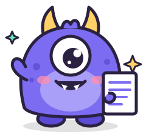

<p align="center">
  
</p>

<h1 align="center">pdfmonster</h1>

<p align="center">
  <b>Feed it crooked scans. It spits out straight ones.</b><br>
  A tiny, very fast desktop app (and CLI) that straightens skewed pages in scanned PDFs.
</p>

---

Meet **Munch**. Munch hates wonky scans: the page you slapped on the copier a little sideways, the
receipt that slid while the lid closed, the 200-page stack from the document feeder where every
page is off by a different amount. Munch finds how crooked each page is and puts it straight.

## Why it's fast

- **Native, GPU-drawn UI** built with [gpui](https://www.gpui.rs), the framework behind the Zed editor. No browser, no Electron.
- **Every page is analysed in parallel** on all your CPU cores.
- **Projection-profile skew detection** on a downscaled page: a coarse 0.25° sweep across ±15°, then a
  0.02° refinement. A few milliseconds per page.
- **Lossless output.** Munch never re-encodes your scans. Each page gets a single rotation matrix
  added to its content stream, so the output is the same quality and almost exactly the same size
  as the input. An 8-page, 3 MB scan comes out about 1.6 KB bigger.

On an M-series Mac, an 8-page 200 dpi scan is analysed, straightened and saved in about 50 ms.

## Using the app

```sh
cargo run --release              # opens the app
cargo run --release -- scan.pdf  # opens the app with a file
```

1. Drop a PDF on the window (or press <kbd>⌘O</kbd> / <kbd>Ctrl+O</kbd>).
2. Every page shows up already straightened. Crooked pages have a purple outline and a `↻ +1.24°` badge.
3. Press <kbd>Space</kbd> to flip between **before** and **after**.
4. Use <kbd>−</kbd> / <kbd>+</kbd> to nudge a page by 0.1°, and <kbd>↺</kbd> to go back to Munch's guess.
   Click a page to leave it alone.
5. **Save aligned** (<kbd>⌘S</kbd>) writes `yourfile.aligned.pdf`.

## Using the CLI

```sh
pdfmonster fix scan.pdf                 # → scan.aligned.pdf
pdfmonster fix scan.pdf -o straight.pdf
```

```
page    1: +0.71° (confidence 63.2)
page    2: +3.27° (confidence 64.2)
page    3: -2.25° (confidence 68.9)
...
straightened 8/8 pages → scan.aligned.pdf in 51 ms
```

## Building

You need a recent stable Rust (edition 2024). On macOS, gpui compiles its Metal shaders at
runtime, so you don't need Xcode's Metal toolchain. On Linux, install the usual gpui dependencies
(Vulkan, Wayland/X11 and xkbcommon headers).

```sh
cargo build --release
cargo test
```

## How it works

1. **Find the scan.** For every page, [lopdf](https://github.com/J-F-Liu/lopdf) finds the largest
   embedded image and decodes it as grayscale. JPEG (`DCTDecode`) and Flate/LZW images in gray,
   RGB, CMYK or 1-bit are supported.
2. **Measure the skew.** The page is binarised with an Otsu threshold. For each candidate angle,
   the ink pixels are projected onto the rotated vertical axis. When the angle matches the lines
   of text, the histogram turns into sharp peaks and gaps. Munch picks the angle with the sharpest
   profile. Pages with too little structure, such as photos or blank pages, are left alone.
3. **Straighten losslessly.** The page's content is wrapped in `q … cm … Q` with a rotation around
   the centre of the page, on a white background so the corners stay clean.

## Limitations

- CCITT fax, JBIG2 and JPEG 2000 images can't be decoded yet. Those pages are reported and skipped.
- Munch corrects small skews of up to ±15°. It doesn't turn pages that are upside down or sideways.
- Only the page's biggest image is used to measure the angle, which is what you want for scans.

## License

[GPL-3.0](LICENSE). Munch is free-range.
